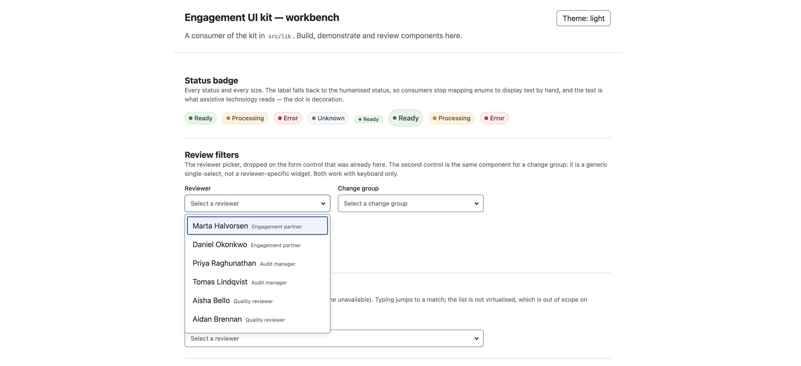
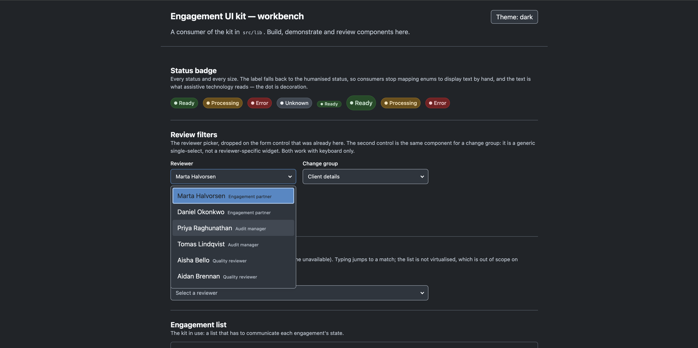

# Engagement UI Kit — Starter Project

An Angular starter for the design system exercise: a small UI kit, the token layer it is built
on, the components the review screens need, and a workbench application that consumes the kit.
Your exercise brief describes what to build.

**What this file is.** A map of the repository: what the project is, how to run it, and where
things live. The kit's own documentation lives with the kit, in
[`src/lib/README.md`](src/lib/README.md): component APIs, theming and contribution rules. The
written deliverables are in [`documentation/`](documentation).

## Requirements

- Node.js 20.19+, 22.12+ or 24+ (see `.nvmrc`)
- npm 10+

## Running the project

```bash
npm install                 # install dependencies
npm start                   # dev server on http://localhost:4200
npm test                    # run the tests in watch mode
npm test -- --watch=false   # run the tests once
npm run build               # production build
```

Angular 21, zoneless, strict TypeScript. Tests run on Vitest via the Angular CLI. Prettier is
configured (`npx prettier --write .`); formatting is not assessed.

## The domain

- **Engagement** — a piece of client work, e.g. a statutory audit for one client and one year.
- **Change** — one proposed modification to an engagement, categorised by a `group` label.
- **Reviewer** — a person who can be assigned to review an engagement's pending changes.

The kit is the shared component layer these screens are built from. It is consumed by several
product teams, so its public API, its accessibility behaviour and its theming are the parts that
matter.

## The kit

Everything under `src/lib/` is the kit. Its public surface is
[`src/lib/public-api.ts`](src/lib/public-api.ts): consumers import from there and should never
need to reach into a component folder. Its documentation — component APIs, theming and
contribution rules — is [`src/lib/README.md`](src/lib/README.md).

### Tokens

Four files under `src/lib/tokens/`:

| File               | What it is                                                          |
| ------------------ | ------------------------------------------------------------------- |
| `_primitives.scss` | Supplied. Raw values — palette, spacing, radii, type, elevation.    |
| `_semantic.scss`   | The layer that says what those values are _for_. Roles, not values. |
| `_themes.scss`     | Re-points the roles for a second theme (`data-cw-theme`).           |
| `tokens.scss`      | The entry point, loaded once from `src/styles.scss`.                |

Primitives are CSS custom properties, so the layer above them can be re-pointed at runtime. A
primitive says what a value _is_ (`--cw-blue-600`); it never says what it is _for_ — that is a
semantic role. Kit components consume roles and never a primitive, so a theme costs a few dozen
lines and touches no component; `tokens.guard.spec.ts` enforces both rules and fails on a theme
that forgets a role.

### The components

`cw-select` ([`src/lib/select/`](src/lib/select)) is the single-select picker the review screens
needed: a labelled, form-integrated combobox that is operable with the keyboard alone. It is
generic — it knows nothing about reviewers.

`cw-status-badge` ([`src/lib/status-badge/`](src/lib/status-badge)) was supplied and shows an
engagement's processing state. It is real code of the kind that accumulates in a component
library before anyone owns it, and the brief asks you to do something about it: it now has one
`status` input instead of five booleans that could contradict each other, its text is no longer
hidden from assistive technology, and its colours come from the token layer.

## The workbench

`src/app/` is a consumer of the kit, not part of it. It exists so components can be built,
demonstrated and reviewed in a running application. Change it freely — including updating call
sites if you change a component's API.

Its _Review filters_ section shows the picker on the form control that was already there, used
for both a reviewer and a change group, and a theme toggle switches the whole page between the
default and the alternative theme. Sample data lives in
[`src/app/data/engagement-fixtures.ts`](src/app/data/engagement-fixtures.ts); the fixtures are
representative rather than exhaustive, so rely on the shapes rather than on specific ids,
counts, ordering or values.

## Screenshots

Screenshots live in [`documentation/images/`](documentation/images), with a shot list describing
what to capture and the exact filenames. The markup below is ready and commented out until the
files exist, so the README never carries a broken image:

<!--
| Default theme | Alternative theme |
| --- | --- |
|  |  |
-->

## How the kit is put together

The starter was intentionally open about the semantic token layer and how a theme overrides it,
each component's public API, how accessibility behaviour is implemented, how styles are
structured, what the documentation surface looks like, and what is tested. The choices made here
are recorded in [`documentation/DECISIONS.md`](documentation/DECISIONS.md) with the alternatives
that were considered, the component APIs are in
[`src/lib/README.md`](src/lib/README.md), and the release and migration story is in
[`documentation/ADOPTION.md`](documentation/ADOPTION.md).

Visual design is not assessed beyond the components being usable and legible. Storybook is
welcome if you want it, but it is not expected and setting it up is not a good use of the time.

## Layout

```text
README.md                          # this file: the repository map
documentation/
  DECISIONS.md                     # the decisions behind the kit, and the alternatives
  ADOPTION.md                      # versioning, release and migration for the kit
  SUBMISSION.md                    # notes on AI usage, time and next steps
src/
  lib/                             # the kit
    README.md                      # the kit's documentation (API, theming, contributing)
    public-api.ts                  # its public surface
    tokens/
      _primitives.scss             # supplied raw values
      _semantic.scss               # semantic roles: what values are for
      _themes.scss                 # the alternative theme, as re-pointed roles
      tokens.scss                  # style entry point
      tokens.guard.spec.ts         # fails on a colour literal or a missing role
    select/                        # the picker
    status-badge/                  # the supplied component, reworked
  app/                             # the workbench: a consumer of the kit
    app.ts / app.html / app.scss
    app.config.ts
    data/engagement-fixtures.ts    # sample data
  styles.scss                      # tokens + a small reset
```

The brief and any other supplied material live in `resources/` at the repository root.
